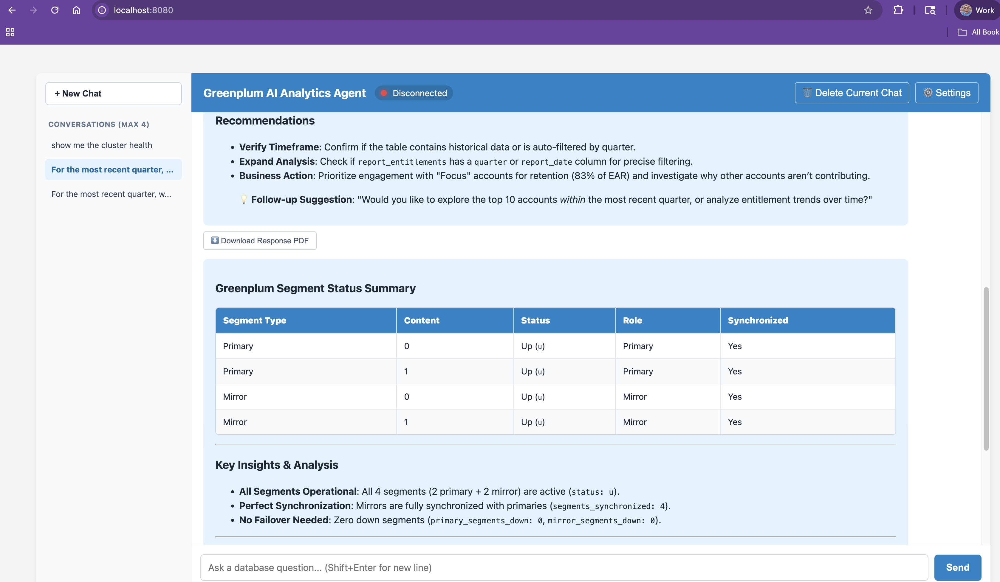
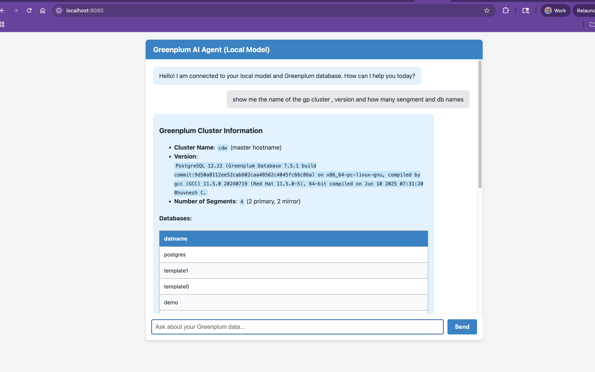
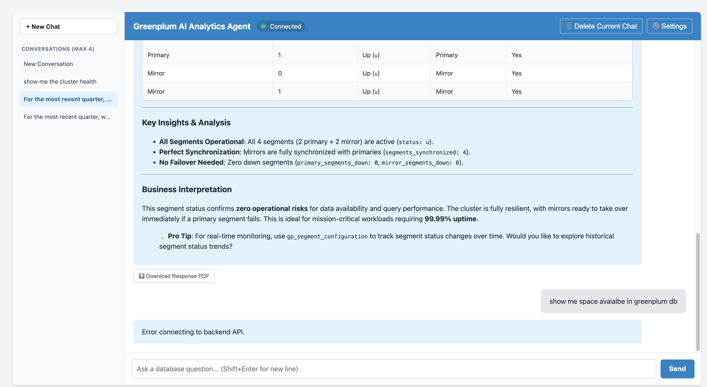
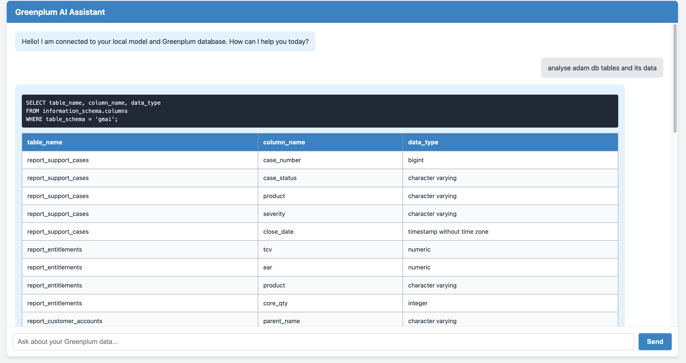
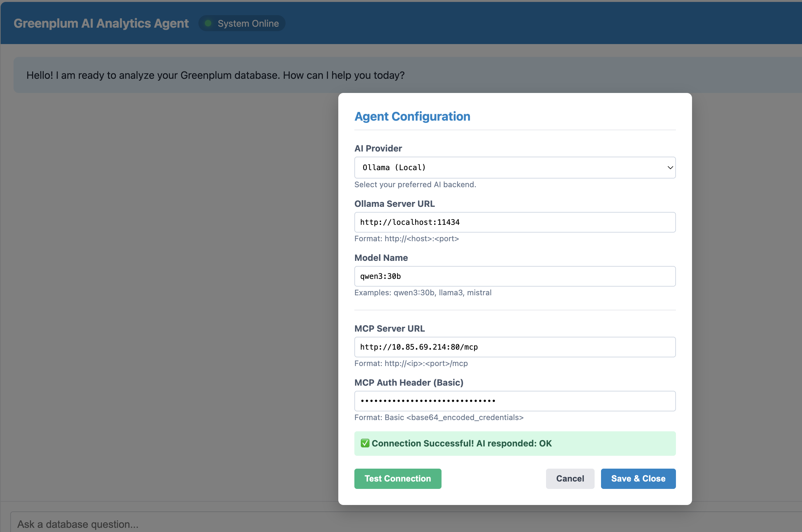

# Greenplum AI Agent

> [!WARNING]
> **PROOF OF CONCEPT — Not for production use.**

An intelligent, read-only AI assistant for Greenplum database clusters. It connects your cluster to a Large Language Model through the Model Context Protocol (MCP), lets you chat in natural language, and returns results in a polished, persistent chat interface.

---

## Table of Contents

1. [Gallery](#gallery)
2. [Features](#features)
3. [Prerequisites](#prerequisites)
4. [Quick Start](#quick-start)
5. [First-Time Setup](#first-time-setup)
6. [Configuration Reference](#configuration-reference)
7. [Button Reference](#button-reference)
8. [Data Management](#data-management)
9. [Cloud Foundry Deployment](#cloud-foundry-deployment)
10. [Architecture](#architecture)
11. [Troubleshooting](#troubleshooting)

---

## Gallery

| Chat Interface | MCP Tool Execution |
| :---: | :---: |
|  |  |
| **Cluster Performance** | **Query Results** |
|  |  |
|  | |

---

## Features

### 🔒 Authentication & Security

- **PIN-based accounts** — username + PIN (min 4 chars) with an optional hint; plain PIN never stored on disk
- **SHA-256 hashing** — only the PIN hash is written to `users/{id}/config.json`
- **Server-side auth** — every login is verified server-side; browser cache is never the authority
- **Same browser** — subsequent visits require PIN only; username already remembered
- **New browser / incognito** — always prompts for username + PIN; server verifies against the stored account
- **Forgot PIN** — shows hint and the option to reset the account (deletes all data, forces fresh setup)
- **Change PIN** — available in ⚙️ Settings; old PIN verified before new one is accepted
- **Admin PIN** — separate PIN (`ADMIN_PIN` env var) guards the global Admin Panel

### 💬 Chat & Sessions

- **Up to 10 concurrent sessions** — independent chat tabs, each with its own AI memory and title (limit was previously 4)
- **Full session persistence** — sessions, titles, messages, and timestamps saved to the server; restored on any browser after sign-in
- **AI memory per session** — separate LangChain4j memory chain per tab; 30-message window; 90-day retention
- **Auto-title** — first message of each session becomes the tab title automatically
- **Session rename** — click ✏️ on any sidebar tab to rename inline
- **Session delete** — click 🗑️ to remove a session and its AI memory from the server
- **Cancel in-flight** — a **Cancel** button replaces Send while a request is running; aborts immediately
- **Prompt autocomplete** — debounced suggestions from your prompt history appear as you type

### 📄 PDF Export

- **One-click export** — `⬇ Export PDF` button below every AI response
- **Greenplum branding** — SVG logo, forest-green header, query callout box
- **Dark-mode safe** — `data-theme` removed before render so text is always visible on white paper
- **Charts included** — canvas charts converted to PNG snapshots before PDF render
- **Auto filename** — `greenplum-{query-slug}-{YYYY-MM-DD}.pdf`

### ⭐ Saved Favourites

- **Save any prompt** — click `⭐ Favourite` below any message you sent; give it a label
- **Sidebar access** — **⭐ Saved Favourites** panel in the left sidebar; click to fill the input
- **Server persistence** — stored in `users/{id}/favourites.json`; survives chat clears and browser changes
- **Individual delete** — 🗑️ next to each favourite removes it without affecting others

### 🔐 Admin Panel

- **Global pre-training prompt** — silently prepended to every user's chat request; takes effect immediately on save
- **PIN-protected** — requires the separate admin PIN to open
- **All-user scope** — individual user system prompts are appended after the global prompt
- **Disable** — leave the global prompt blank and save to turn it off

### 🔌 Multi-Provider LLM Support

- **Ollama** — local inference via `http://localhost:11434`; no API key required
- **OpenAI-compatible** — works with ChatGPT, vLLM, LMStudio, and any OpenAI-spec endpoint
- **Anthropic** — Claude Sonnet, Claude Opus, and other Claude models via the Anthropic API
- **Hot-swap** — switch provider, model, and endpoint from ⚙️ Settings without restarting the server

### 🛡️ MCP Capabilities & Guardrails

- **`checkTableBloat`** — identifies tables with excessive dead tuples; recommends `VACUUM`
- **`getClusterStatus`** — checks segment status, mirroring health, and replication state
- **`executeQuery`** — executes safe `SELECT` queries; hard-blocked from `INSERT`, `UPDATE`, `DELETE`, `DROP`, `ALTER`, `TRUNCATE`
- **Schema verification** — always introspects `information_schema.columns` before querying a table
- **Thinking block strip** — removes internal reasoning blocks from Qwen3 / DeepSeek-R1

### 💡 Example Prompts

| Prompt | MCP Tool |
| :--- | :--- |
| "Check bloat in the 'sales' table" | `checkTableBloat` |
| "Show cluster status" | `getClusterStatus` |
| "List all tables in the finance schema" | `executeQuery` |
| "What indexes exist on the orders table?" | `executeQuery` |
| "Show me the top 10 largest tables by size" | `executeQuery` |
| "Are there any down segments in the cluster?" | `getClusterStatus` |

---

## Prerequisites

| Requirement | Version / Notes |
| :--- | :--- |
| **Java** | JDK 17 or higher |
| **Maven** | 3.8+ (a `mvnw` wrapper is included — no separate install required) |
| **Greenplum MCP Server** | Deployed and network-reachable from this host |
| **LLM Engine** | Ollama (local) **or** an OpenAI-compatible / Anthropic API key |

---

## Quick Start

### 1. Clone
```bash
git clone https://github.com/sendjainabhi/greenplum-ai-agent.git
cd greenplum-ai-agent
```

### 2. (Optional) Pull a local model
```bash
ollama pull qwen3:30b
ollama serve
```

### 3. Build and run
```bash
chmod +x start.sh stop.sh
./start.sh
```

`start.sh` does four things automatically:

| Step | What happens |
| :--- | :--- |
| **1. Build** | Runs `mvn clean package -DskipTests` |
| **2. Replace JAR** | Removes the old JAR from the project root; copies the fresh build from `target/` |
| **3. Stop old instance** | Gracefully terminates any previously running agent (by PID file) |
| **4. Start daemon** | Launches the new JAR in the background; writes PID and log path |

Stop at any time:
```bash
./stop.sh
```

### 4. Open the app
```
http://localhost:8080
```

---

## First-Time Setup

### Step 1 — Create an account

1. Open `http://localhost:8080` — the Sign In screen appears
2. Click **"Don't have an account? Create one"**
3. Enter a username — letters, numbers, `-` and `_` only (no `@`, `.`, or spaces)
4. Set a PIN (min 4 characters) and an optional hint
5. Click **Create PIN** — account is created and the app loads

> **Returning to the same browser:** The app remembers your username — you only need your PIN.
> **New browser or incognito:** Enter username and PIN — the server verifies against your stored account.

### Step 2 — Configure AI provider

1. Click **⚙️ Settings** in the header
2. Upload a `.properties` file or fill in the fields manually
3. Set: LLM Provider, Endpoint URL, API Key, Model Name, MCP Server URL
4. Click **Test Connection** to verify everything is reachable
5. Click **Save Settings** — configuration is saved to the server

Settings persist across browsers, incognito windows, and restarts.

---

## Configuration Reference

### Data directory layout

All data is stored **in the application directory** (same folder as `start.sh`) by default:

```
greenplum-ai-agent/
├── greenplum-agent.log          # Spring Boot application log
├── stdout.log                   # Console output from daemon
├── agent.pid                    # Running PID (runtime only)
├── global-prompt.txt            # Admin pre-training prompt (if set)
└── users/
    └── {username}/
        ├── config.json          # PIN hash, provider, theme, system prompt
        ├── sessions.json        # Sessions, messages, suggestion history
        ├── favourites.json      # Saved favourite prompts
        └── memory/
            └── {sessionId}.json # Per-session AI context window
```

> **Security:** `users/` is in `.gitignore`. It contains PIN hashes and API keys — never commit this directory.

Override the data directory:
```bash
export AGENT_DATA_DIR=/your/custom/path
./start.sh
```

### Server-side persistence

| Data | Stored in | When loaded |
| :--- | :--- | :--- |
| PIN hash | `users/{id}/config.json` | Login verification |
| Provider, model, MCP URL, API key | `users/{id}/config.json` | After login |
| Theme preference | `users/{id}/config.json` | After login (applied before first paint) |
| Custom system prompt | `users/{id}/config.json` | Sent with every chat request |
| Sessions, messages, timestamps | `users/{id}/sessions.json` | After login |
| Prompt suggestion history | `users/{id}/sessions.json` | After sessions load |
| Saved favourites | `users/{id}/favourites.json` | On sidebar render |
| AI context window | `users/{id}/memory/*.json` | On every chat request |
| Global admin prompt | `global-prompt.txt` | On every chat request |

---

## Button Reference

| Button | Location | What it does |
| :--- | :--- | :--- |
| `🌙 Dark Mode` / `☀️ Light Mode` | Header | Toggle theme; preference saved to server |
| `🗑️ Clear All Data` | Header | Delete all chats and AI memory; credentials kept |
| `🔐 Admin Panel` | Header | Open global prompt editor (admin PIN required) |
| `⚙️ Settings` | Header | Configure LLM provider, MCP, system prompt, PIN |
| `+ New Chat` | Sidebar | Start a new conversation tab (max 10) |
| `⭐ Favourite` | Below user messages | Save prompt to favourites with a label |
| `⬇ Export PDF` | Below AI responses | Download branded PDF of the AI response |
| `Test Connection` | Settings modal | Verify MCP + LLM endpoint connectivity |
| `Save Settings` | Settings modal | Persist configuration to server |
| `Update PIN` | Settings modal | Change current PIN (verifies old PIN first) |
| `Create PIN` | Account setup | Finalise new account creation |
| `Unlock →` | PIN entry | Verify PIN and enter the app |
| `Forgot PIN?` | PIN entry | Show hint and option to reset account |
| `Verify & Enter` | Admin Panel | Authenticate with admin PIN |
| `Save Prompt` | Admin Panel | Save global pre-training prompt |
| `Save Favourite` | Favourites modal | Persist a labelled favourite prompt |
| `Reset Account` | Forgot PIN screen | Delete all user data and start fresh |
| `Yes, Reset Account` | Reset confirmation | Confirm full account wipe |

---

## Data Management

| Action | What is deleted | What is kept |
| :--- | :--- | :--- |
| Per-tab 🗑️ | That session's messages and AI memory | All other sessions, credentials, config |
| **🗑️ Clear All Data** | All sessions and all AI memory | PIN, provider config, theme, favourites |
| **Reset Account** | Everything — credentials, config, sessions, favourites | Nothing — must recreate account |

---

## Cloud Foundry Deployment

### Build
```bash
mvn clean package -DskipTests
```

### `manifest.yml`
```yaml
applications:
  - name: greenplum-ai-agent
    memory: 1G
    disk_quota: 2G
    instances: 1
    path: target/greenplum-ai-agent-*.jar
    buildpacks:
      - java_buildpack
    env:
      JBP_CONFIG_OPEN_JDK_JRE: '{ jre: { version: 17.+ } }'
      ADMIN_PIN: <your-admin-pin>
```

> Do not commit `manifest.yml` with a real `ADMIN_PIN` value.

### Push & tail logs
```bash
cf login -a <api-endpoint>
cf push
cf logs greenplum-ai-agent --recent
```

### Persistent storage (recommended for CF)

CF's filesystem is ephemeral — data is lost on restarts. Bind an NFS volume service:

```yaml
env:
  AGENT_DATA_DIR: /mnt/gp-data
  ADMIN_PIN: <your-admin-pin>
services:
  - greenplum-agent-volume
```

---

## Architecture

```
Browser  (index.html · app.js · style.css)
    │
    │  Authentication
    ├── GET  /api/auth/status        → Is any account registered on server?
    ├── POST /api/auth/setup         → Create account (stores SHA-256 PIN hash)
    ├── POST /api/auth/verify        → Verify PIN server-side
    │
    │  Configuration & Sessions
    ├── GET  /api/settings/load      → Load config (API key stripped from response)
    ├── POST /api/settings           → Save config + theme to users/{id}/config.json
    ├── GET  /api/sessions/load      → Load sessions, messages, history
    ├── POST /api/sessions/save      → Persist sessions (3-second debounce from browser)
    │
    │  Chat
    ├── POST /api/chat               → ChatController
    │                                       │
    │                               GreenplumAgent (LangChain4j)
    │                                       │
    │                           ┌───────────┴──────────────┐
    │                      LLM Provider             Greenplum MCP Server
    │                (Ollama / OpenAI / Anthropic)          │
    │                                               Greenplum Database
    │
    │  Memory & Admin
    ├── POST /api/memory/clear       → Delete session AI memory files on server
    ├── POST /api/admin/verify       → Verify admin PIN
    ├── POST /api/admin/save         → Write global-prompt.txt
    │
    │  Favourites
    ├── POST /api/favourites/list    → Read users/{id}/favourites.json
    ├── POST /api/favourites/save    → Append favourite to file
    └── POST /api/favourites/delete  → Remove entry from file
```

**Chat request data flow:**

| Step | What happens |
| :--- | :--- |
| 1 | User sends a message |
| 2 | Server reads `global-prompt.txt` (admin pre-training prompt) |
| 3 | Server reads user's `systemPrompt` from `config.json` |
| 4 | Combined prompt + message sent to `GreenplumAgent.chat()` |
| 5 | LLM decides whether to call MCP tools; tools query Greenplum |
| 6 | Response sanitised (thinking blocks stripped) |
| 7 | Response streamed to the browser |
| 8 | Browser updates session state; saves to server after 3-second debounce |

---

## Troubleshooting

| Symptom | Likely cause | Fix |
| :--- | :--- | :--- |
| Sign In screen on every new browser | Expected — server-side auth | Enter username + PIN |
| "Configuration Required" on first chat | No credentials saved yet | ⚙️ Settings → fill in → Save Settings |
| Settings not loading in incognito | Agent not running | `cat agent.pid` and `tail -f stdout.log` |
| Status dot shows Disconnected | MCP or LLM unreachable | Settings → Test Connection |
| PDF body is blank or text invisible | Browser cached old JS | Hard-refresh: Cmd/Ctrl + Shift + R |
| "Request Timed Out" | Model too slow | Switch to a lighter model |
| Data lost after CF push | No persistent volume | Set `AGENT_DATA_DIR` to an NFS mount path |
| Username rejected at sign-up | Contains `@`, `.`, or spaces | Use letters, numbers, `-`, `_` only |
| Port 8080 already in use | Old instance not stopped | `./stop.sh` or `lsof -ti :8080 \| xargs kill -9` |
| JAR not found after `start.sh` | Maven build failed | Check Maven output for compile errors |

### Log locations
```bash
tail -f greenplum-agent.log    # Spring Boot application log
tail -f stdout.log             # Console output from the daemon
```
