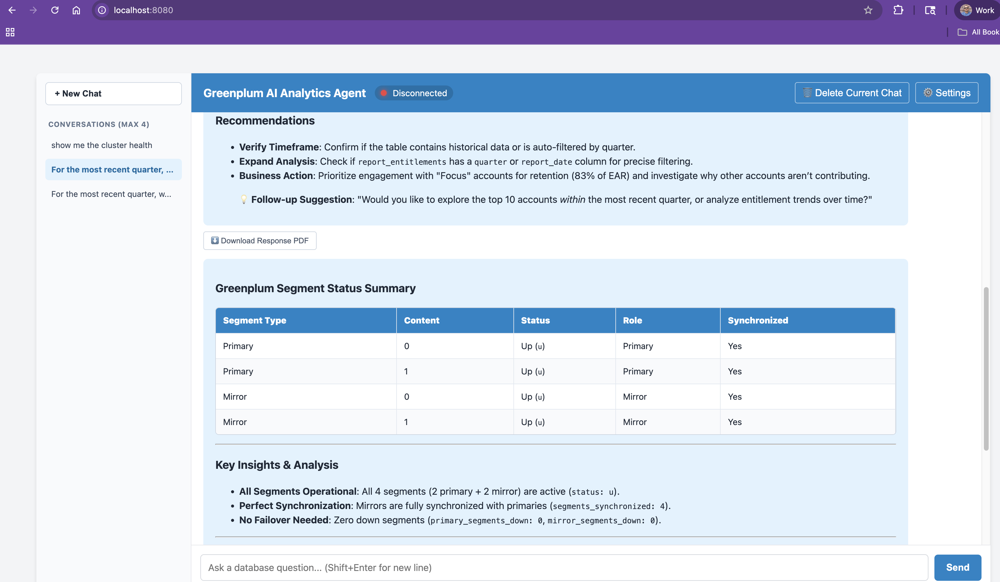
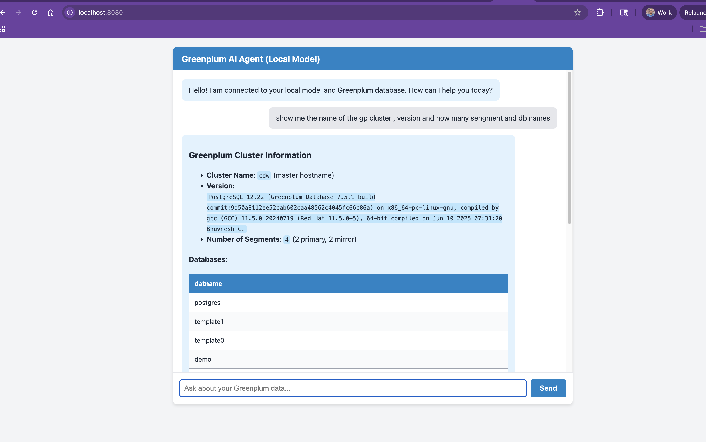
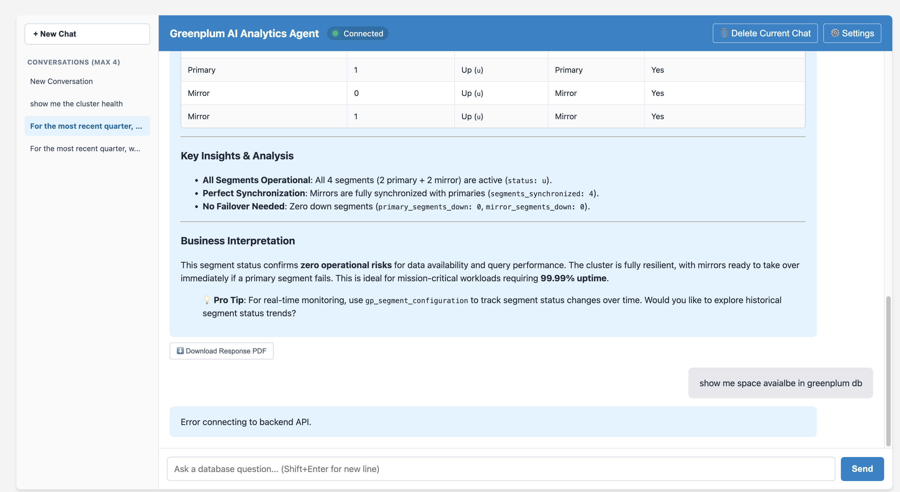
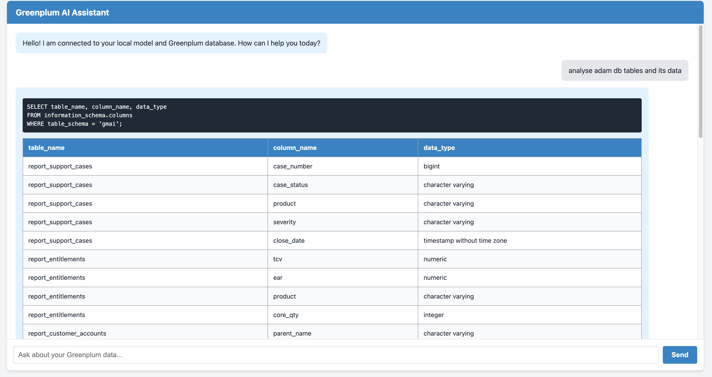
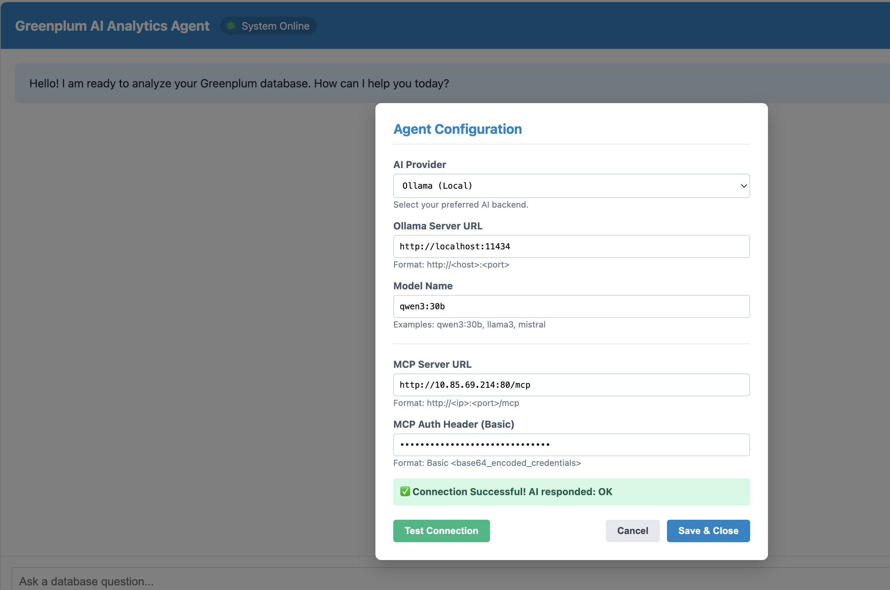

# Greenplum AI Agent

> [!WARNING]
> **PROOF OF CONCEPT — Not for production use.**

A Cloud Foundry-native AI assistant for the Tanzu data platform. Bind your Tanzu GenAI model service and MCP data services, push the app — users create a PIN once and start chatting with their Greenplum database and OpenMetadata catalog in natural language. No manual configuration required.

---

## Table of Contents

1. [Gallery](#gallery)
2. [How It Works](#how-it-works)
3. [Platform Services](#platform-services)
4. [Deployment](#deployment)
5. [MCP Capabilities](#mcp-capabilities)
6. [Example Prompts](#example-prompts)
7. [Features](#features)
8. [Architecture](#architecture)
9. [Troubleshooting](#troubleshooting)

---

## Gallery

| Chat Interface | MCP Tool Execution |
| :---: | :---: |
|  |  |
| **Cluster Performance** | **Query Results** |
|  |  |
|  | |

---

## How It Works

At container startup the app reads all AI model and MCP credentials directly from VCAP_SERVICES. There is nothing to configure in the UI.

Users open the URL, create a personal PIN, and chat immediately. Each user's sessions, AI memory, and saved prompts are stored independently on the server — fully isolated per account.

The connection status header shows live indicators for every bound platform service:

- **Model dot** — green when the AI model endpoint is reachable; red when not
- **Greenplum dot** — green when the Greenplum MCP service is connected; red when not bound or failing
- **OpenMetadata dot** — shown only when that service is bound; green/red per connection

---

## Platform Services

The app is driven entirely by CF service bindings. The ops team creates services once; developers push the app and bind — no code changes needed.

### AI Model — Tanzu GenAI (`ai-models`)

Bind the Tanzu GenAI marketplace service (label `ai-models`, tags `genai` or `llm`). Credentials are resolved automatically from CredHub by the Java buildpack at container startup.

Supported credential formats:

| Format | Description |
| :--- | :--- |
| **Tanzu GenAI v2** | `credentials.endpoint.{openai_api_base, api_key, name}` — current marketplace format |
| **Tanzu GenAI v1** | `credentials.{api_url, api_key}` — legacy flat format |
| **User-provided** | `credentials.{provider, baseUrl, apiKey, modelName}` — custom vLLM or other endpoint |

If `modelName` is not present in the credentials, the app auto-discovers the model by querying the `/models` endpoint and selecting the first non-embedding model (skips bge-m3, e5-, rerank, and similar variants).

Supported LLM providers: **OpenAI-compatible** (vLLM, LMStudio, ChatGPT), **Anthropic**, **Ollama**.

### Greenplum MCP (`gp-mcp-greenplum`)

User-provided service pointing to a running Greenplum MCP server.

```bash
cf create-user-provided-service gp-mcp-greenplum \
  -p '{"type":"greenplum","url":"http://gp-mcp.internal/mcp","auth":"Basic <base64>"}'
```

### OpenMetadata MCP (`gp-mcp-openmetadata`)

User-provided service pointing to a running OpenMetadata MCP server. Bind when catalog queries are needed.

```bash
cf create-user-provided-service gp-mcp-openmetadata \
  -p '{"type":"openmetadata","url":"http://om-mcp.internal/mcp","auth":"Bearer <jwt>"}'
```

---

## Deployment

### Prerequisites

| Requirement | Notes |
| :--- | :--- |
| **Java buildpack** | `java_buildpack_offline` v4.90+ — resolves CredHub refs at container start |
| **CF CLI** | 7.x or higher |
| **Tanzu GenAI service** | Provides the AI model — required |
| **Greenplum MCP server** | Required for Greenplum queries |
| **OpenMetadata MCP server** | Optional — bind to enable catalog queries |

### 1. Build

```bash
./mvnw clean package -DskipTests
```

### 2. Create platform services (ops team, run once per environment)

```bash
# AI model — Tanzu GenAI marketplace service:
cf create-service ai-models <plan> gp-ai-model

# OR a user-provided service for a custom vLLM endpoint:
cf create-user-provided-service gp-ai-model \
  -p '{"provider":"openai","baseUrl":"http://vllm.internal/v1","apiKey":"sk-...","modelName":"qwen2.5:32b"}'

# Greenplum MCP:
cf create-user-provided-service gp-mcp-greenplum \
  -p '{"type":"greenplum","url":"http://gp-mcp.internal/mcp","auth":"Basic <base64>"}'

# OpenMetadata MCP (optional):
cf create-user-provided-service gp-mcp-openmetadata \
  -p '{"type":"openmetadata","url":"http://om-mcp.internal/mcp","auth":"Bearer <jwt>"}'
```

### 3. Push and bind

```bash
cf push greenplum-ai-agent -p target/greenplum-ai-agent-1.0.0.jar --no-start

cf bind-service greenplum-ai-agent gp-ai-model
cf bind-service greenplum-ai-agent gp-mcp-greenplum
# cf bind-service greenplum-ai-agent gp-mcp-openmetadata  # add when ready

cf start greenplum-ai-agent
```

### 4. Share the URL and chat

```bash
cf app greenplum-ai-agent   # shows the assigned route
```

**First visit:** open the URL, enter a username, set a PIN — account created and chat is ready.  
**Returning visits (same browser):** PIN only (username remembered).  
**New browser or incognito:** username + PIN, verified server-side.

### `manifest.yml`

```yaml
---
applications:
- name: greenplum-ai-agent
  path: greenplum-ai-agent-1.0.0.jar
  memory: 2G
  instances: 1
  buildpacks:
    - java_buildpack_offline
  env:
    JBP_CONFIG_OPEN_JDK_JRE: '{ jre: { version: 17.+ } }'
    SPRING_PROFILES_ACTIVE: cloud
    ADMIN_PIN: <your-admin-pin>
    # AGENT_DATA_DIR: /mnt/greenplum-data  # NFS mount for session persistence

  services:
    - gp-ai-model
    - gp-mcp-greenplum
    # - gp-mcp-openmetadata
```

> Do not commit `manifest.yml` with real credentials or PIN values.

### Persistent storage

CF containers are ephemeral — user sessions are lost on restart without a volume. Bind an NFS volume service:

```yaml
env:
  AGENT_DATA_DIR: /mnt/gp-data
services:
  - gp-ai-model
  - gp-mcp-greenplum
  - greenplum-agent-volume
```

### PIN management

| Action | How |
| :--- | :--- |
| **Change PIN** | Click **🔒 Change PIN** in the header |
| **Forgot PIN** | Click **Forgot PIN?** on the login screen → shows hint and Reset Account option |
| **Reset Account** | Forgot PIN → **Reset Account** — removes all user data; account must be recreated |

---

## MCP Capabilities

### Greenplum

| Tool | Purpose |
| :--- | :--- |
| `executeQuery` | Safe `SELECT` queries; blocks all write/DDL operations |
| `checkTableBloat` | Identifies tables with excessive dead tuples and recommends `VACUUM` |
| `getClusterStatus` | Segment health, mirroring state, and replication status |

Schema introspection (`information_schema.columns`) is always performed before querying a table.

### OpenMetadata

| Tool | MCP Call | Purpose |
| :--- | :--- | :--- |
| `searchAssets` | `search_metadata` | Keyword search across tables, dashboards, pipelines, topics, ML models, glossary terms, domains |
| `getEntityDetails` | `get_entity_details` | Full metadata: columns, tags, owners, descriptions, service details |
| `getLineage` | `get_entity_lineage` | Upstream sources and downstream consumers (3 hops by default) |
| `listEntities` | `search_metadata` | Overview list by entity type |
| `getDataQualityResults` | `search_metadata` (testCase) | Data quality test results for a table |
| `rootCauseAnalysis` | `root_cause_analysis` | Upstream failures and downstream impact |

---

## Example Prompts

**Greenplum:**

| Prompt | Tool |
| :--- | :--- |
| "Check bloat in the 'sales' table" | `checkTableBloat` |
| "Show cluster status" | `getClusterStatus` |
| "List all tables in the finance schema" | `executeQuery` |
| "Show me the top 10 largest tables by size" | `executeQuery` |
| "Are there any down segments in the cluster?" | `getClusterStatus` |

**OpenMetadata:**

| Prompt | Tool |
| :--- | :--- |
| "What data services are available in the catalog?" | `listEntities` |
| "Show me all tables in the telco schema" | `searchAssets` |
| "What columns does the sales table have?" | `searchAssets` → `getEntityDetails` |
| "Show lineage for the orders table" | `getLineage` |
| "Are there data quality tests for the customers table?" | `getDataQualityResults` |
| "Do a root cause analysis on the pipeline failure" | `rootCauseAnalysis` |

---

## Features

### 🔒 User Accounts & PIN

- **PIN-based accounts** — username + PIN (min 4 chars) with an optional hint
- **Per-user isolation** — sessions, AI memory, and favourites are stored independently per account
- **Same browser** — subsequent visits require PIN only
- **New browser / incognito** — username + PIN, verified server-side
- **Change PIN** — accessible from the header at any time after login
- **Forgot PIN** — hint shown; account reset available if PIN is lost

### 💬 Chat & Sessions

- **Up to 10 concurrent sessions** — independent chat tabs with separate AI memory and titles
- **Full session persistence** — saved to server; restored on next login from any browser
- **AI memory per session** — 30-message context window per tab
- **Auto-title** — first message becomes the session tab title
- **Session rename / delete** — inline from the sidebar
- **Cancel in-flight** — Cancel button aborts a running model request immediately
- **Prompt autocomplete** — debounced suggestions from prompt history as you type

### 📄 PDF Export

- **One-click export** — `⬇ Export PDF` below every AI response
- **Greenplum branding** — SVG logo, forest-green header
- **Charts included** — canvas charts converted to PNG before render
- **Auto filename** — `greenplum-{query-slug}-{YYYY-MM-DD}.pdf`

### ⭐ Saved Favourites

- Save any prompt with a label for quick reuse
- Accessible from the sidebar; persisted server-side across browsers

### 🔐 Admin Panel

- Global pre-training prompt prepended silently to every chat request
- Protected by the `ADMIN_PIN` environment variable
- Leave blank and save to disable

---

## Architecture

```
Browser  (index.html · app.js)
    │
    │  Boot — reads platform service info from server
    ├── GET  /api/auth/status    → model name, MCP services, user registration state
    │
    │  PIN Auth
    ├── POST /api/auth/setup     → Create account (stores SHA-256 PIN hash)
    ├── POST /api/auth/verify    → Verify PIN
    ├── POST /api/auth/change-pin → Change PIN (verifies current PIN first)
    │
    │  Chat
    ├── POST /api/chat           → Stream response from LangChain4j agent
    │       │
    │       ▼  VcapServicesConfig reads VCAP_SERVICES at startup
    │   ChatController
    │       │
    │       ├── Greenplum bound ──► GreenplumAgent
    │       │                           └── GreenplumMcpTools ──► Greenplum Database
    │       │
    │       ├── OpenMetadata bound ► OpenMetadataAgent
    │       │                           └── OpenMetadataMcpTools ──► OpenMetadata Catalog
    │       │
    │       └── Both bound ──────► GreenplumAgent
    │                               ├── GreenplumMcpTools ──► Greenplum Database
    │                               └── OpenMetadataMcpTools ──► OpenMetadata Catalog
    │
    │  Connectivity test (runs on every login)
    ├── GET  /api/test/cf        → modelStatus, mcpStatus, omMcpStatus
    │
    │  Sessions & Memory
    ├── GET  /api/sessions/load
    ├── POST /api/sessions/save
    └── POST /api/memory/clear
```

**VCAP_SERVICES credential resolution:**

| Binding | Credential path | Model discovery |
| :--- | :--- | :--- |
| Tanzu GenAI v2 | `credentials.endpoint.{openai_api_base, api_key}` | Auto via `/models` |
| Tanzu GenAI v1 | `credentials.{api_url, api_key}` | Auto via `/models` |
| User-provided AI | `credentials.{provider, baseUrl, apiKey, modelName}` | Uses `modelName` or auto |
| User-provided MCP | `credentials.{type, url, auth}` | N/A |

---

## Troubleshooting

| Symptom | Likely cause | Fix |
| :--- | :--- | :--- |
| Model dot red on startup | AI service not bound or CredHub resolution failed | `cf bind-service` + `cf restage`; check startup logs |
| Greenplum dot always red | Greenplum MCP service not bound | `cf bind-service greenplum-ai-agent gp-mcp-greenplum` + restage |
| Model shown as "Model" with no name | Auto-discovery found no chat model at `/models` | Verify vLLM deployment includes a non-embedding model |
| OpenMetadata dot not visible | Service not bound | Bind `gp-mcp-openmetadata` and restage |
| Sessions lost after restage | No persistent volume | Set `AGENT_DATA_DIR` to an NFS mount path |
| Status dots stuck on yellow | App cannot reach `/api/test/cf` internally | `cf logs greenplum-ai-agent --recent` |
| "Request Timed Out" | Model responding slowly | Use a lighter model or increase CF memory |
| Forgot PIN | — | Click **Forgot PIN?** on the login screen |
| Old UI after deploy | Browser cache | Hard-refresh: Cmd/Ctrl + Shift + R |

### Logs

```bash
cf logs greenplum-ai-agent --recent   # startup, CredHub resolution, binding errors
cf logs greenplum-ai-agent            # live tail during operation
```

### Key log markers

| Prefix | Meaning |
| :--- | :--- |
| `[VCAP] CF mode active` | VCAP_SERVICES bindings detected at startup |
| `[VCAP] model config:` | Resolved AI endpoint and model name |
| `[VCAP] MCP config:` | Resolved MCP server URL and auth |
| `[VCAP] discovered model:` | Model selected via `/models` auto-discovery |
| `[OM-MCP] Available tools:` | OpenMetadata MCP tool names loaded on connect |
| `OM-MCP TOOL OUTBOUND` | Tool name + arguments sent to OpenMetadata |
| `OM-MCP TOOL INBOUND` | Raw response from OpenMetadata |
